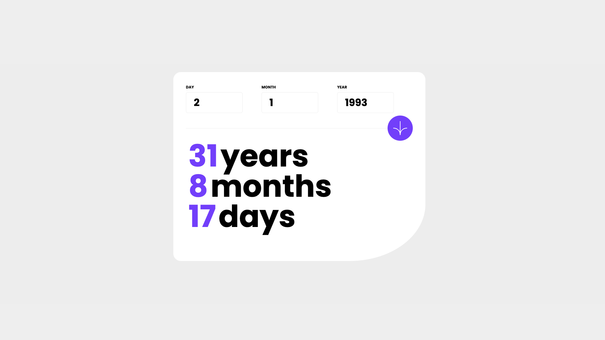

# Frontend Mentor - Age calculator app


## Welcome! 👋

Thanks for checking out this front-end coding challenge.

[Frontend Mentor](https://www.frontendmentor.io) challenges help you improve your coding skills by building realistic projects.

**To do this challenge, you need a decent understanding of HTML, CSS and JavaScript.**

## The challenge

Your challenge is to build out this age calculator app and get it looking as close to the design as possible.

You can use any tools you like to help you complete the challenge. So if you've got something you'd like to practice, feel free to give it a go.

Your users should be able to: 

- View an age in years, months, and days after submitting a valid date through the form
- Receive validation errors if:
  - Any field is empty when the form is submitted
  - The day number is not between 1-31
  - The month number is not between 1-12
  - The date is in the future
  - The date is invalid e.g. 31/04/1991 (there are 30 days in April)
- View the optimal layout for the interface depending on their device's screen size
- See hover and focus states for all interactive elements on the page
- **Bonus**: See the age numbers animate to their final number when the form is submitted

Want some support on the challenge? [Join our community](https://www.frontendmentor.io/community) and ask questions in the **#help** channel.

# Frontend Mentor - Age calculator app solution

This is a solution to the [Age calculator app challenge on Frontend Mentor](https://www.frontendmentor.io/challenges/age-calculator-app-dF9DFFpj-Q). Frontend Mentor challenges help you improve your coding skills by building realistic projects.

## Table of contents

- [Overview](#overview)
  - [The challenge](#the-challenge)
  - [Screenshot](#screenshot)
  - [Links](#links)
- [My process](#my-process)
  - [Built with](#built-with)
  - [What I learned](#what-i-learned)
  - [Continued development](#continued-development)
  - [Useful resources](#useful-resources)
- [Author](#author)
- [Acknowledgments](#acknowledgments)

**Note: Delete this note and update the table of contents based on what sections you keep.**

## Overview

### The challenge

Users should be able to:

- View an age in years, months, and days after submitting a valid date through the form
- Receive validation errors if:
  - Any field is empty when the form is submitted
  - The day number is not between 1-31
  - The month number is not between 1-12
  - The year is in the future
  - The date is invalid e.g. 31/04/1991 (there are 30 days in April)
- View the optimal layout for the interface depending on their device's screen size
- See hover and focus states for all interactive elements on the page
- **Bonus**: See the age numbers animate to their final number when the form is submitted

### Screenshot




### Links

- Solution URL: [Add solution URL here](https://your-solution-url.com)
- Live Site URL: [Add live site URL here](https://your-live-site-url.com)

## My process

I'm actually learning Vue so there's no particular process.
I started with the layout which isn't finished yet, then I added the mathematical logic.

### Built with

- Mobile-first workflow
- [Vue.JS](https://vuejs.org) - JS library
- [Tailwindcss](https://tailwindcss.com/) - For styles


### What I learned

I learned conditional rendering with 'v-if' which I still do not fully understand.
And it was a good exercise to practice logical thinking.


### Continued development

I'm still struggling with the day operation which is sometimes render with a negative number.

See example below or full code in the project :
```js
const day = now.getDay() ; // returns a number representing the day of the week, starting with 0 for Sunday
```
```html
<p><span>{{ actualDay }}</span>days</p>
```

### Useful resources

- [SheCodes](https://www.shecodes.io/athena/13276-how-to-get-current-day-and-time-in-javascript#:~:text=To%20get%20the%20current%20day%20and%20time%20in%20JavaScript%2C%20you,the%20built%2Din%20Date%20object.&text=const%20now%20%3D%20new%20Date()%3B,getHours()%3B%20const%20minutes%20%3D%20now.) - This helped me to get current date object to make logical function 

## Author

- Website - [Sola Kabuta](https://solakabuta.com/)
- Frontend Mentor - [@SolaKabuta](https://www.frontendmentor.io/profile/SolaKabuta)


